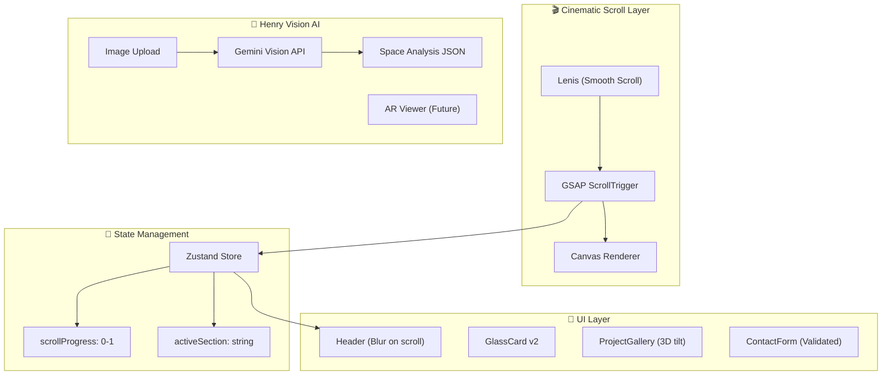
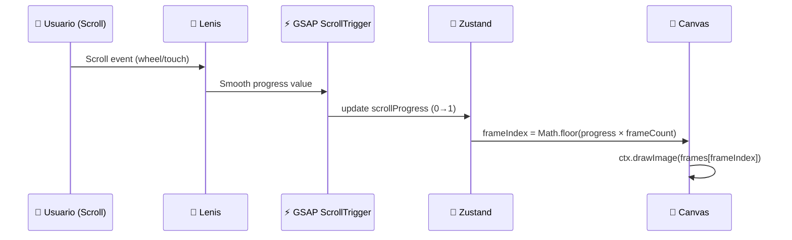
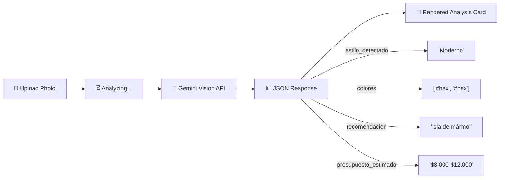
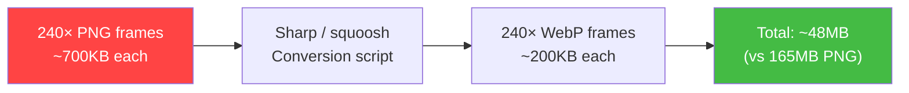

# 🏗️ ARCHITECTURE PLAN — Henry Kitchen & Closet

> Objetivo: Elevar el sitio de "boilerplate funcional" a nivel **Awwwards / Apple Quality**  
> Fecha: 2026-02-10 | Autor: System Architect Agent

---

## Tabla de Contenidos

1. [Visión General](#1-visión-general)
2. [Cinematic Scroll System](#2-cinematic-scroll-system)
3. [Henry Vision — AI Module](#3-henry-vision--ai-module)
4. [Estructura de Carpetas Propuesta](#4-estructura-de-carpetas-propuesta)
5. [Componentes a Crear / Refactorizar](#5-componentes-a-crear--refactorizar)
6. [Pipeline de Assets](#6-pipeline-de-assets)
7. [Plan de Verificación](#7-plan-de-verificación)

---

## 1. Visión General



---

## 2. Cinematic Scroll System

### Arquitectura del `<canvas>` Frame Renderer

El componente `ImageSequenceCanvas` es el corazón del sitio. Emula el efecto que Apple usa en las páginas de AirPods/MacBook: al hacer scroll, los frames de un video pre-renderizado se dibujan en un `<canvas>`, creando una animación cinematográfica controlada por el usuario.

#### Diagrama de Flujo



#### Estrategia de Carga de Frames (3 fases)

| Fase | Frames | Momento | Prioridad |
|---|---|---|---|
| **Preload Crítico** | 1–50 | `onMount`, antes de que el usuario scrollee | 🔴 Máxima |
| **Preload Progresivo** | 51–150 | Background, después del primer paint | 🟡 Media |
| **Lazy Load** | 151–240 | On-demand según posición de scroll | 🟢 Baja |

#### Performance Requirements

- **Canvas Blitting**: Usar `requestAnimationFrame` para throttle (max 60fps)
- **Format**: Frames deben ser **WebP** (60-70% menos que PNG)
- **Resolución**: Max 1920×1080 para desktop, art-direction con set más pequeño para mobile
- **Memory**: Mantener pool de ~100 frames en memoria, evictar los que están >50 frames de distancia

#### Implementación Técnica

```typescript
// Pseudocódigo del componente core
interface ImageSequenceCanvasProps {
  /** Ruta base de los frames (e.g., "/scroll/sequence-1") */
  sequencePath: string;
  /** Cantidad total de frames */
  frameCount: number;
  /** Extensión de los frames (default: "webp") */
  format?: "webp" | "png";
  /** Pin height en vh (cuánto scroll = 1 secuencia completa) */
  scrollHeight?: string;
}

// Hook interno: useFrameLoader
// - Fase 1: Promise.all(frames[0..49])
// - Fase 2: requestIdleCallback para frames[50..149]
// - Fase 3: IntersectionObserver trigger para frames[150+]

// GSAP ScrollTrigger config
gsap.to(progress, {
  value: 1,
  ease: "none",
  scrollTrigger: {
    trigger: containerRef,
    start: "top top",
    end: "bottom bottom",
    scrub: 0.5, // Suavidad Apple-like (0 = inmediato, 1+ = lento)
    pin: true,
    anticipatePin: 1,
  }
});
```

### Lenis Integration

```typescript
// src/components/providers/SmoothScrollProvider.tsx
// Wrapper que inicializa Lenis en el layout root
// - lerp: 0.075 (velocidad Apple-like: suave pero no lento)
// - duration: 1.2
// - orientation: 'vertical'
// - smoothWheel: true
// - Syncronizar con GSAP: lenis.on('scroll', ScrollTrigger.update)
```

---

## 3. Henry Vision — AI Module

### Nivel 1: Análisis de Espacio (MVP Inmediato)

Un módulo donde el usuario sube una foto de su cocina/closet actual y recibe un análisis profesional con recomendaciones personalizadas.

#### Flujo del Usuario



#### Arquitectura Técnica

```
src/
├── app/
│   └── vision/              ← Página dedicada
│       └── page.tsx          ← UI de upload + resultados
│
├── app/api/vision/
│   └── analyze/
│       └── route.ts          ← API Route (server-side, protege API key)
│
├── components/vision/
│   ├── ImageUploader.tsx     ← Drop zone + preview + compress
│   ├── AnalysisCard.tsx      ← Muestra resultados con animación
│   └── ColorPalette.tsx      ← Visualiza colores detectados
│
├── lib/
│   └── gemini.ts             ← Cliente Gemini configurado
│
└── types/
    └── vision.ts             ← Tipos del response
```

#### Schema del Response (Gemini)

```typescript
interface SpaceAnalysis {
  estilo_detectado: 'Moderno' | 'Clásico' | 'Rústico' | 'Minimalista' | 'Industrial' | 'Transicional';
  confianza: number; // 0-100
  colores_dominantes: Array<{
    hex: string;
    nombre: string;
    porcentaje: number;
  }>;
  material_detectado: string[]; // ["Granito", "Madera de Roble"]
  recomendaciones: Array<{
    titulo: string;
    descripcion: string;
    prioridad: 'alta' | 'media' | 'baja';
  }>;
  presupuesto_estimado: {
    rango_min: number;
    rango_max: number;
    moneda: 'USD';
  };
  mejoras_sugeridas: string[]; // ["Agregar isla central", "Iluminación bajo mueble"]
}
```

#### Prompt Engineering (Gemini)

```
Actúa como un diseñador de interiores experto en carpintería de lujo.
Analiza la siguiente imagen de un espacio (cocina o closet).

Devuelve un JSON con la siguiente estructura exacta:
{schema}

REGLAS:
- estilo_detectado: Clasifica en las categorías dadas
- colores_dominantes: Máximo 5, ordenados por predominancia
- recomendaciones: Máximo 3, enfocadas en mejoras de carpintería
- presupuesto_estimado: Basado en el mercado de USA/Uruguay para carpintería premium
- Responde SOLO con el JSON, sin markdown ni explicaciones
```

### Nivel 2: AR Viewer (Futuro — Phase 3)

```html
<!-- Web Component de Google model-viewer -->
<model-viewer
  src="/models/kitchen-island.glb"
  ar
  ar-modes="scene-viewer webxr quick-look"
  camera-controls
  shadow-intensity="1.5"
  environment-image="neutral"
  poster="/images/poster-island.webp"
/>
```

- Requiere modelos `.glb` (GLTF binary) de los muebles
- AR funciona nativamente en iOS (Quick Look) y Android (Scene Viewer)
- No requiere app — funciona en el browser

---

## 4. Estructura de Carpetas Propuesta

```
src/
├── app/
│   ├── globals.css              ← Design tokens + Lenis overrides
│   ├── layout.tsx               ← Root layout con SmoothScrollProvider
│   ├── page.tsx                 ← Landing principal (scroll cinematográfico)
│   ├── vision/
│   │   └── page.tsx             ← Henry Vision AI page
│   └── api/
│       └── vision/
│           └── analyze/
│               └── route.ts     ← API endpoint para Gemini
│
├── components/
│   ├── layout/
│   │   └── Header.tsx           ← Refactorizar: blur + hide on scroll
│   ├── ui/
│   │   ├── glass-card.tsx       ← Mejorar: cursor glow + tilt
│   │   ├── Logo.tsx             ← Mantener
│   │   ├── contact-form.tsx     ← Conectar a Supabase
│   │   └── project-gallery.tsx  ← Migrar a GSAP horizontal scroll
│   ├── scroll/
│   │   ├── ImageSequenceCanvas.tsx    ← [NEW] Core: Canvas + GSAP
│   │   ├── ScrollSection.tsx          ← [NEW] Wrapper de sección
│   │   └── ScrollTextReveal.tsx       ← [NEW] Texto que aparece con scroll
│   ├── vision/
│   │   ├── ImageUploader.tsx          ← [NEW] Upload + compress
│   │   ├── AnalysisCard.tsx           ← [NEW] Resultados AI
│   │   └── ColorPalette.tsx           ← [NEW] Colores detectados
│   └── providers/
│       └── SmoothScrollProvider.tsx   ← [NEW] Lenis wrapper
│
├── hooks/
│   ├── useSmoothScroll.ts       ← [NEW] Hook para Lenis instance
│   ├── useScrollStore.ts        ← [NEW] Zustand store de scroll
│   └── useFrameLoader.ts        ← [NEW] Preload progresivo de frames
│
├── lib/
│   ├── utils.ts                 ← Mantener (cn utility)
│   ├── gemini.ts                ← [NEW] Gemini client
│   ├── animations.ts            ← [NEW] Curvas bezier + presets GSAP
│   └── supabase/                ← Mantener
│
└── types/
    ├── supabase.ts              ← Mantener
    └── vision.ts                ← [NEW] Tipos de Henry Vision
```

---

## 5. Componentes a Crear / Refactorizar

### [NEW] Componentes Nuevos

| Componente | Archivo | Descripción |
|---|---|---|
| `ImageSequenceCanvas` | `components/scroll/ImageSequenceCanvas.tsx` | Canvas + GSAP ScrollTrigger, carga progresiva de frames |
| `ScrollSection` | `components/scroll/ScrollSection.tsx` | Wrapper reutilizable: pin + overlay text + sequence |
| `ScrollTextReveal` | `components/scroll/ScrollTextReveal.tsx` | SplitText animado por línea/palabra con scroll |
| `SmoothScrollProvider` | `components/providers/SmoothScrollProvider.tsx` | Inicializa Lenis, synca con GSAP |
| `ImageUploader` | `components/vision/ImageUploader.tsx` | Drag & drop, compresión client-side, preview |
| `AnalysisCard` | `components/vision/AnalysisCard.tsx` | Card animada con resultados del análisis |
| `ColorPalette` | `components/vision/ColorPalette.tsx` | Grid visual de colores detectados |

### [REFACTOR] Componentes Existentes

| Componente | Cambio |
|---|---|
| `scroll-sequence.tsx` | **Reemplazar** Framer Motion → GSAP ScrollTrigger. Mantener API. Renombrar a `ImageSequenceCanvas`. |
| `glass-card.tsx` | **Mejorar**: Agregar cursor glow effect (radial gradient sigue el mouse), subtle parallax tilt (3D transform) |
| `project-gallery.tsx` | **Migrar** horizontal scroll de Framer Motion → GSAP ScrollTrigger. Agregar efecto de parallax por card. |
| `Header.tsx` | **Mejorar**: Backdrop blur dinámico, auto-hide on scroll down, show on scroll up. Logo scale animation. |
| `contact-form.tsx` | **Conectar** a Supabase (insert en tabla `contact_requests`). Validación con Zod. |
| `layout.tsx` | **Envolver** con `SmoothScrollProvider`. Cambiar fuentes a Cinzel + Inter. |
| `globals.css` | **Agregar** tokens de Micro-Lujo, spacing system, Lenis overrides, animaciones custom |

---

## 6. Pipeline de Assets

### Optimización de Frames (PRE-REQUISITO)



**Script de conversión** (Node.js con sharp):
```bash
# Ejecutar una vez para cada sequence-N
node scripts/optimize-frames.js --input public/scroll/sequence-1 --output public/scroll/sequence-1-webp --quality 80
```

### Imágenes de Galería

- Las 52 imágenes del portafolio (referenciadas en `ProjectGallery`) deben estar en `/public/images/projects/`
- Actualmente el directorio referenciado usa hashes como nombres — se recomienda renombrar con nombres descriptivos
- Optimizar a WebP + generar thumbnails para lazy loading

---

## 7. Plan de Verificación

### Verificación Automatizada

1. **Build test**: `npm run build` — Verificar que no hay errores de compilación TypeScript
2. **Lint**: `npm run lint` — Sin errores de ESLint después de cada cambio

### Verificación Manual (Browser)

1. **Smooth Scroll**: Abrir en Chrome DevTools → verificar que Lenis elimina el "jank" del scroll nativo
2. **Canvas Performance**: DevTools → Performance tab → verificar que el canvas redraw mantiene 60fps
3. **Responsive**: Chrome DevTools Device Mode → iPhone 14 Pro, iPad, Desktop
4. **Memory**: DevTools → Memory tab → verificar que el frame loader no causa memory leaks (frames se evictan correctamente)
5. **Loading**: Network tab throttle "Slow 3G" → verificar que aparece skeleton mientras cargan los frames

### Verificación de Henry Vision (Phase 2)

1. **Upload**: Subir imagen JPG/PNG → verificar preview y compresión
2. **API Response**: Verificar que la respuesta de Gemini se parsea correctamente
3. **Error Handling**: Subir archivo inválido → verificar mensaje de error amigable
4. **Rate Limiting**: Verificar protección contra abuse en el API route
